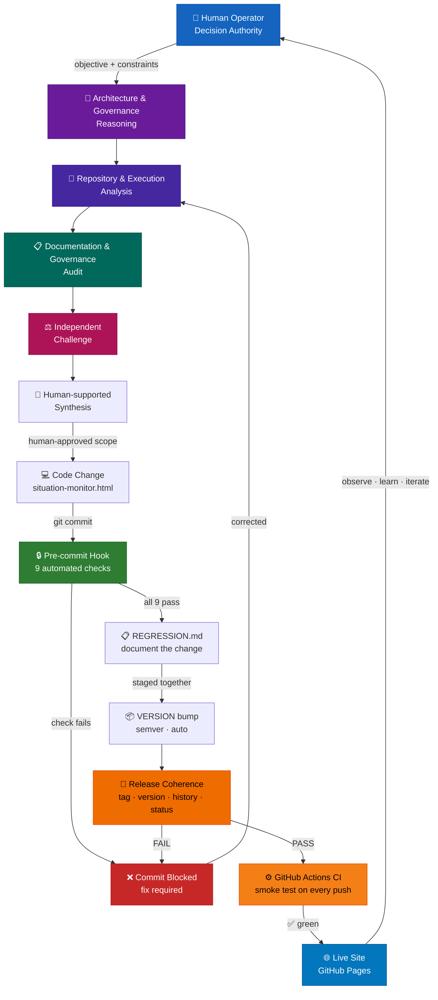
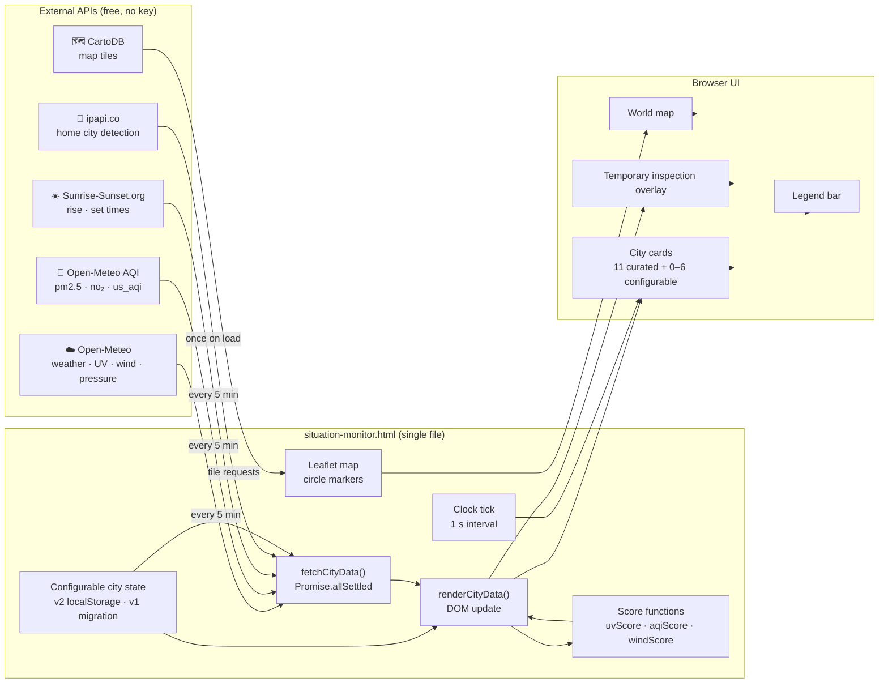
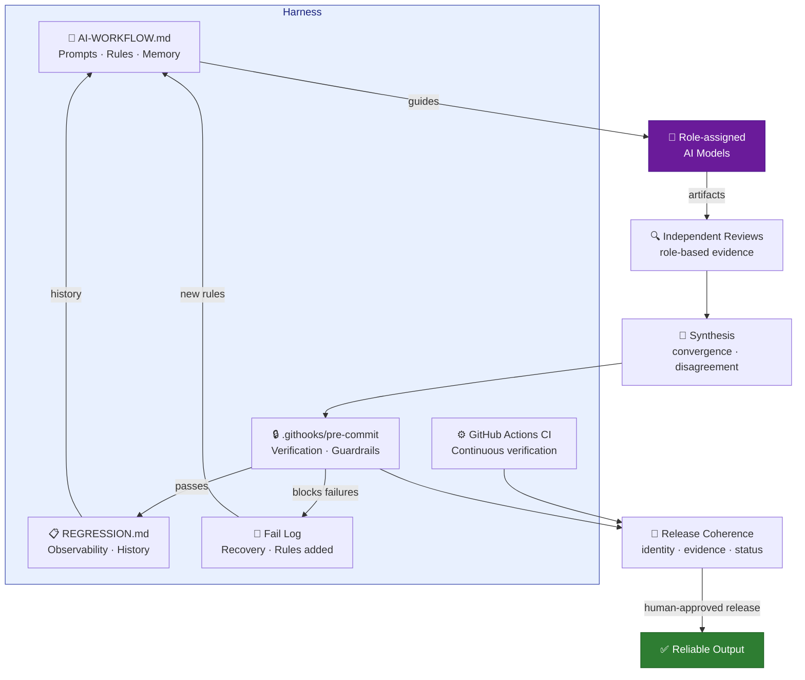

# Architecture — Situation Monitor

**Date:** 2026-05-29
**Added in:** v2.10.0
**Author:** Jussi Mantynen

Two diagrams: the agentic development workflow, and the runtime data architecture.

---

## Agentic Development Workflow

How this project is built and maintained — the harness in motion.

**The harness is the governed path between Human and Live Site.**
Roles are architectural; current model implementations may change. Independent review, synthesis,
release coherence and Human release authority are part of the current path established through
ADR-005, ADR-006 and the v3.2.2 coherence correction.

---

## Runtime Data Architecture

How the live dashboard fetches and displays data.

---

## Harness Components Map

How the harness wraps the model.

