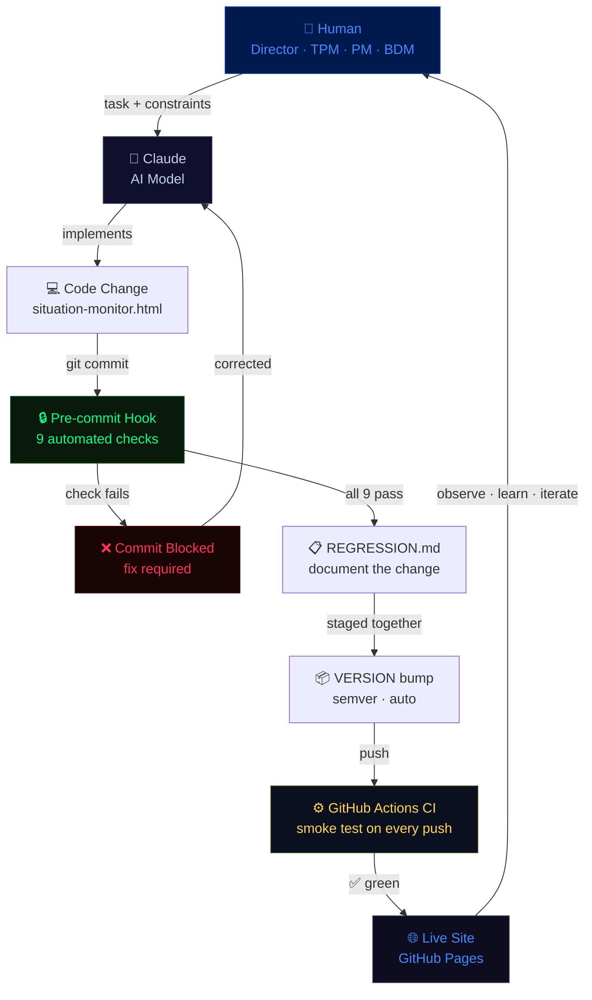
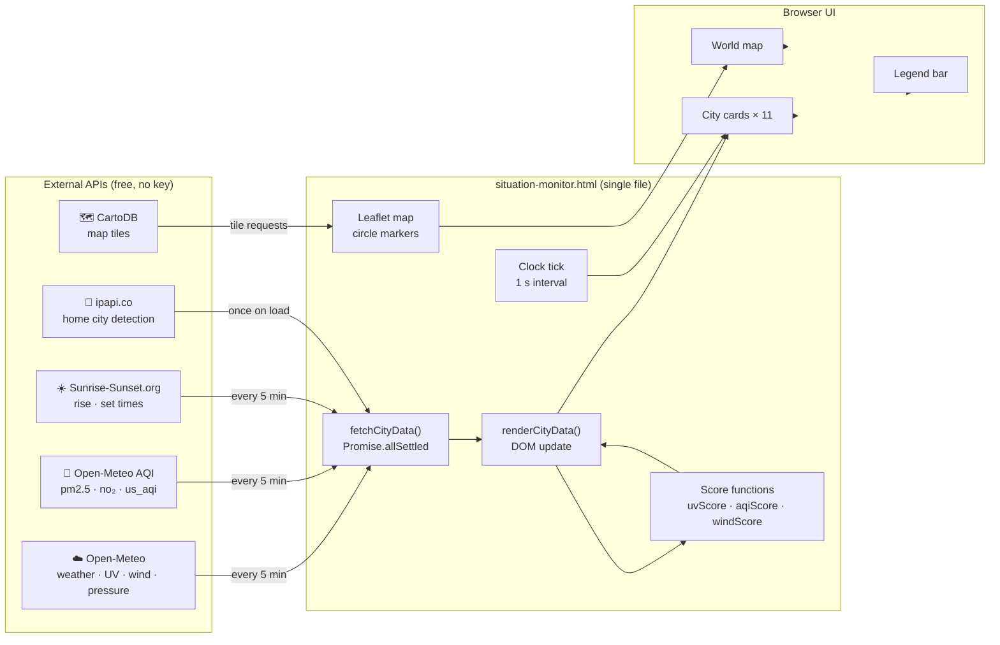
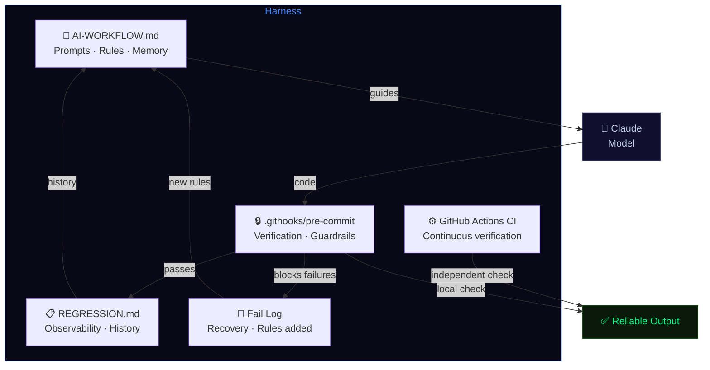

# Architecture — Situation Monitor

Two diagrams: the agentic development workflow, and the runtime data architecture.

---

## Agentic Development Workflow

How this project is built and maintained — the harness in motion.

**The harness is the path between Human and Live Site.**
Every step that is not the model is part of the harness.

---

## Runtime Data Architecture

How the live dashboard fetches and displays data.

---

## Harness Components Map

How the harness wraps the model.

